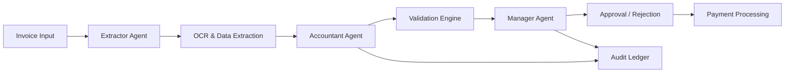
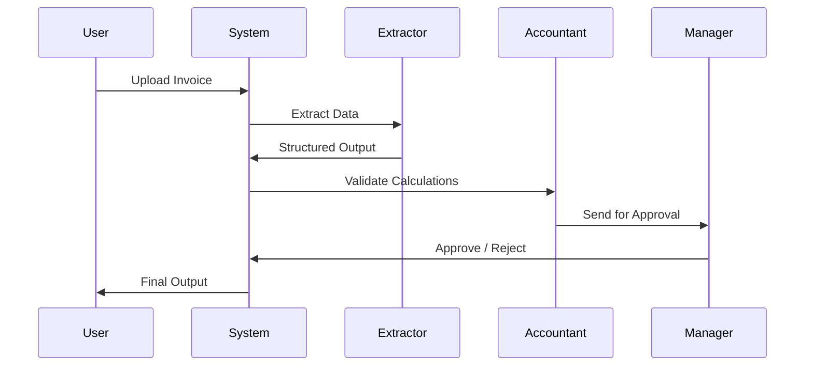

# 🚀 SmartProcure AI

### Autonomous Enterprise Workflow for Intelligent Invoice Management

---

## 🧠 Overview

SmartProcure AI is an enterprise-grade **autonomous procurement system** powered by a **Multi-Agent AI Architecture**.

It transforms unstructured invoice data into **structured financial intelligence** using intelligent agents, real-time validation, and explainable decision-making.

---

## 🖼️ System Architecture


---

## 🏗️ Architecture Flow



---


---

## 🔄 How It Works



---

## 🚀 Key Features

* 🤖 **Autonomous Multi-Agent Workflow** (Extractor, Accountant, Manager)
* 🔁 **Self-Correction Engine** for automatic re-validation
* 📜 **Dynamic Policy Enforcement** via natural language rules
* 💬 **Explainable AI Assistant** for audit reasoning
* 📊 **ROI Dashboard** (Time Saved & Loss Prevented)
* 🔐 **Immutable Audit Ledger** with cognitive trace logs
* 📈 **Vendor Trust Scoring** using predictive analytics

---

## 📸 Application Screenshots


---


## 🛠️ Tech Stack

* **LLM:** Gemini 1.5 Flash
* **Frontend:** React 19, Tailwind CSS, Framer Motion
* **Backend:** Node.js, Express
* **Database:** SQLite (Better-SQLite3)
* **Document Processing:** PDF-Parse, Tesseract.js
* **Export Tools:** jsPDF, html2canvas

---

## 🚀 Installation & Setup

```bash
# Clone repository
git clone https://github.com/vinay-potnuri/SmartProcure-AI-Autonomous-Invoice-Workflow.git

# Navigate into project
cd SmartProcure-AI-Autonomous-Invoice-Workflow

# Install dependencies
npm install

# Run application
npm run dev
```

---

## 📂 Project Structure

```bash
src/
 ├── assets/
 │    └── images/
 ├── components/
 ├── pages/
 ├── App.tsx
 ├── main.tsx
```

---

## 📈 Future Enhancements

* 🔮 Predictive financial analytics
* 🌍 Multi-language invoice processing
* ☁️ Cloud deployment (AWS / Azure)
* 🧠 Self-learning AI agents

---

## 🤝 Contribution

Contributions are welcome! Feel free to fork the repo and submit pull requests.

---

## 📄 License

MIT License

---

## 🏆 Hackathon Ready

Built for enterprise automation, scalability, and real-world AI impact.

---

## 👨‍💻 Author

**Vinay Potnuri**
🔗 [https://github.com/vinay-potnuri](https://github.com/vinay-potnuri)

---
